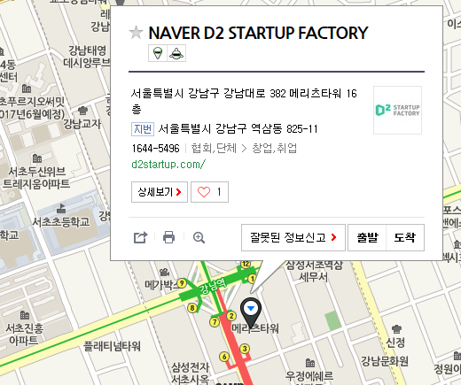

# 2017년

 NAVER D2 개발자 커뮤니티 지원 프로그램에서 후원합니다(http://d2.naver.com/home)
 
 일시 : 12/2 토, 오후 2시 - 6시 00분 (4시간)
 
 장소 : NAVER D2 STARTUP FACTORY
       강남역 2번 출구, 메리츠 타워 16층.
 
 참가신청 : 
 
 github - https://github.com/KaggleBreak/studybreak/
 

## 스케쥴

|    시간        |      제목                                | 발표자  |  내용   |   발표자료                                         |
|:---	        |:---	                                  |:---	    |:---	 |:---	|
|2시  | 워밍업                         |   | |    |
|싸이그래머   | 그룹 소개       | 김무성 | |  |
|    | (특강) 개발자가 바라보는 깊이 있는 텍스트 데이터 !?!       | 김태욱 | |  |
|    | (특강) Deep Probabilistic Programming | 이재영 |  |
|바벨피쉬 | 그룹 소개        | 김무성 | |  |
|    | (특강) GAN을 이용한 한글 문장 생성       | 오영택 | |  |
|    | (특강) 강화학습을 이용한 챗봇 만들기 | 김성동 |  |
|    | 쉬는 시간       |  | |  |
|3시 |         |  | |  |
|딥리워드 | 그룹 소개          | 김무성 | |  |
|    | (특강) DIY 강화학습(나만의 슈퍼마리오 뚝딱뚝딱 만들기)       | 정원석 | |  |
|    | (특강) 분산 강화학습       | 김정주 | |  |
|    | (특강) 강화학습 기반 챗봇을 위한 시뮬레이터 만들기       | 김영삼 | |  |
|캐글뽀개기    | 그룹 소개          | 이상열 | |  |
|    | (특강) CodeOnWeb 및 backend.ai 소개 | 김준기 | |  |
|    | 쉬는 시간       |  | |  |
|4시 |        |  | |  |
|바이오스핀 | 그룹 소개          | 이승우 | |  |
|    | (특강) 힌튼과 콩나무 - 딥러닝을 이용한 콩 유전체 정보 예측 | 강양제 | |  |
|    | (특강) 생물정보학 관련 | 박혜진 | |  |
|싸이지먼트 | 그룹 소개         | 김성근  | |  |
|    | (특강) 애드테크101 | 이상현  | |  |
|데이터그램    | 그룹 소개          | 김승욱 | |  |
|    | 쉬는 시간       |  | |  |
|5시    |         |  | |  |
|싸이랭    | 그룹 소개        | 한수미 | |  |
|심플랙스 컴플랙서티    | 그룹 소개   | 심상진 | |  |
|알파로우    | 그룹 소개          | 이재석 | |  |
|AI Finance    | 그룹 소개          | 송준호 | |  |
|    | (특강) 딥러닝 + 금융        | 송준호 | |  |
|    | 마무리       |  | |  |
