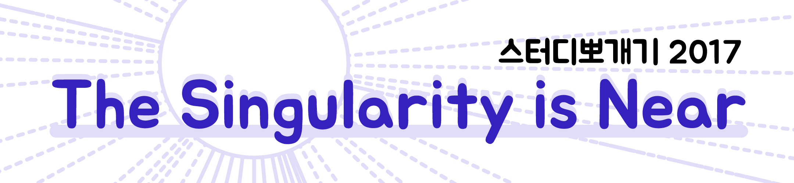

# 2017년

 NAVER D2 개발자 커뮤니티 지원 프로그램에서 후원합니다(http://d2.naver.com/home)
 
 일시 : 12/2 토, 오후 2시 - 6시 30분 (4시간 30분)
 
 장소 : NAVER D2 STARTUP FACTORY
       강남역 2번 출구, 메리츠 타워 16층.
 
 참가신청 방법 : https://www.facebook.com/events/1536498469729530/  (이벤트의 참석 버튼)
  
 github - https://github.com/KaggleBreak/studybreak/
 

## 스케쥴

| 시간                | 제목                                                                  | 발표자 | 발표자료 |
|:---	|:---	|:---	|:---	|
| 2시 분 ~ 2시 5분    | 싸이버스 전체 소개                                                    | 김무성 |[발표자료](https://drive.google.com/open?id=1nXSfNk7-z74zULzBZX6NKixc6KD-3lmU6Nlr_TujsHI)|
| 2시 5분 ~ 2시 10분  | 캐글뽀개기 소개                                                       | 이상열 |[발표자료](https://drive.google.com/open?id=1ry3dxJRanKvHFBeQig1KeoTdwlYg65NxTNj8okdEM1E)|
| 2시 10분 ~ 2시 25분 | (바벨피쉬-특강) 강화학습을 이용한 챗봇 만들기                         | 김성동 |[발표자료](https://drive.google.com/open?id=13HJVHTV5SYN49kgeUa20oM0SkVOysC4C)|
| 2시 25분 ~ 2시 40분 | (싸이그래머-특강) 개발자가 바라보는 깊이 있는 텍스트 데이터 !?!       | 김태욱 |          |
| 2시 40분 ~ 2시 55분 | (싸이그래머-특강) Deep Probabilistic Programming                      | 이재영 |          |
| 2시 55분 ~ 3시      | 싸이랭 소개                                                           | 김무성 |[발표자료](https://drive.google.com/open?id=1SeD74ItdrpAuB3lWceZ5LgRrBbaCf8D6ztCAwsLr23U)|
| 3시 ~ 3시 10분      | 쉬는 시간                                                             |        |          |
| 3시 10분 ~ 3시 15분 | 딥리워드 소개                                                         | 김무성 |          |
| 3시 15분 ~ 3시 30분 | (캐글뽀개기-특강) CodeOnWeb 및 backend.ai 소개                        | 김준기 |          |
| 3시 30분 ~ 3시 45분 | (딥리워드-특강) 분산 강화학습                                         | 김정주 |[발표자료](https://drive.google.com/open?id=1LSN12iY0bNDKmDeqlgGoswqpUqWjDgsI)|
| 3시 45분 ~ 4시      | (바벨피쉬-특강) 강화학습 기반 QA 시스템                               | 김영삼 |[발표자료](https://drive.google.com/open?id=1dWM6fRufZFWQvqp2NKvqXjrfBe_68tnu)|
| 4시 ~ 4시 10분      | 쉬는 시간                                                             |        |          |
| 4시 10분~ 4시 15분  | 바벨피쉬 소개                                                         | 송치성 |[발표자료](https://drive.google.com/open?id=1gcT3YR1f9GnSz1YN4eDJljiYBiibgzq3vTDuj7hvbIo)  |
| 4시 15분 ~ 4시 30분 | (딥리워드-특강) DIY 강화학습(나만의 슈퍼마리오 뚝딱뚝딱 만들기)       | 정원석 |[발표자료](https://drive.google.com/open?id=1Kdgyj99Lfx4F84jf8c6-yz9yOmtQN0_TO-EfG11vkBM)|
| 4시 30분 ~ 4시 35분 | 바이오스핀 소개                                                       | 이승우 |[발표자료](https://drive.google.com/open?id=1RW8zHsX_6T6LFvHDj_6TyrSynTK8BlU3)|
| 4시 35분 ~ 4시 50분 | (바이오스핀-특강) 힌튼과 콩나무 - 딥러닝을 이용한 콩 유전체 정보 예측 | 강양제 |[발표자료](https://drive.google.com/open?id=1GDCHDvW_OZnRQMkHcFlHFUxxFMAaCN55)|
| 4시 50분 ~ 5시 5분  | (바이오스핀-특강) 생물정보학 관련                                     | 박혜진 |[발표자료](https://drive.google.com/open?id=1zKCrn0yWyM8La_yil4mLAzg6k46DUOqo)|
| 5시 5분 ~ 5시 15분  | 쉬는 시간                                                             |        |          |
| 5시 15분 ~ 5시 20분 | 싸이지먼트 소개                                                       | 김무성 |[발표자료](https://drive.google.com/open?id=1r7NCOdsih4AupBNr22CLkb22VrRO62pFlMMcmSiIR0Q)|
| 5시 20분 ~ 5시 35분 | (싸이지먼트-특강) 애드테크101                                         | 이상현 |[발표자료](https://drive.google.com/open?id=1k33BzG7tELmilyhhjepV5Kz6GRYE64oI)|
| 5시 35분 ~ 5시 40분 | 데이터그램 소개                                                       | 김승욱 |[발표자료](https://drive.google.com/open?id=1gRFlhco6Zucbruy7RtLAeLADE0t1k4P2)|
| 5시 40분 ~ 5시 45분 | 심플랙스 컴플랙서티 소개                                              | 심상진 |          |
| 5시 45분 ~ 5시 50분 | 알파로우 소개                                                         | 이재석 |[발표자료](https://drive.google.com/open?id=1uwQ8KgD7065l8UCGep4ZLasAkfYFuNGK)|
| 5시 50분 ~ 5시 55분 | AI Finance 소개                                                       | 송준호 |          |
| 5시 55분 ~ 6시 10분 | (AIFin-특강) 딥러닝 + 금융                                            | 송준호 |          |
| 6시 10분 ~ 6시 20분 | 싸이그래머 소개                                                       | 김무성 |[발표자료](https://drive.google.com/open?id=1RTv1-tJJqExtuk5RhCJn2B5jo2B3pYDwVKXhNGoH16s)|
