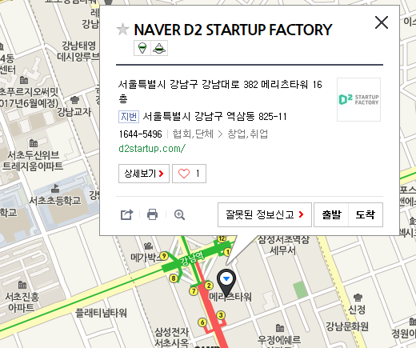

# 2015년

 NAVER D2 개발자 커뮤니티 지원 프로그램에서 후원합니다(http://dev.naver.com/d2)
 일시 : 2015년 12월 19일. 오후 4시부터.
 장소 : NAVER D2 STARTUP FACTORY
       강남역 2번 출구, 메리츠 타워 16층.
 온오프믹스 공지 - http://onoffmix.com/event/57896

## 스케쥴

|    시간        |      제목                                | 발표자  |  내용   |   발표자료                                         |
|:---	         |:---	                                  |:---	    |:---	 |:---	                                               |
|                | 1부                                    |         |         |                                                    |
|4시 ~           | 싸이그래머 소개                        | 김무성  |  [커뮤니티](https://www.facebook.com/groups/psygrammer/), [활동 내역](http://psygrammer.github.io/)       |   slide, code  |
|                | (초청발표) 기계학습을 이용한 설문지에서 무성의한 응답 탐지 | 김형준  | IRT, SVM, MRF을 이용한 무성의 응답 탐지  |   |
|                | (초청발표) 의식연구 엿보기             | 한정규  | 의식에 대한 과학적 탐구의 최신 이론과 논쟁을 살펴본다.        |   |
|4시50분~5시     | Breaking Time                          |         |         |                      |
|                | 2부                                    |         |         |                      |
|5시 ~           | 바벨피쉬 소개 + 복잡계(자연어처리응용) | 송치성  |   [커뮤니티](https://www.facebook.com/groups/babelPish/), [활동 내역](http://babelpish.github.io)      |                                                     |
|                | 머신러닝을 통해 컴퓨터가 동음이의어를 구분하는 방법                      | 송치성  | ‘배’라는 단어에는 여러가지 뜻이 있습니다. 배는 경우에 따라서 운송수단의 의미로 사용하기도 하고, 신체일부의 의미로 사용하기도 하고, 과일의 의미로 사용하기도 하는 동음이의어입니다. 이처럼 우리가 무심코 하는 말 중에는 형태는 같지만 의미는 다른 어의중의성(WSD; Word Sense Disambiguation)을 가진 단어들이 있습니다. 그런데 쓰여진 문장만보고 컴퓨터가 그 의미를 유추할 수 있을까요? 머신러닝을 통해 어의중의성을 해소할 수 있는 방법인 word2vec과 그 단점을 보완한 방법을 소개합니다.        |                                                     |
|5시30분 ~       | 데이터그램과 함께한 일년               | 송한나  |  [커뮤니티](https://www.facebook.com/groups/datergram/), [활동 내역](http://datergram.github.io/)       |                                                            |
|                | (초청발표) 데이터 저널리즘과 시각화| 최윤원  |  좋은 데이터, 좋은 저널리즘, 좋은 시각화에 대한 이야기       |                                                           |
|6시00분~6시10분 | Breaking Time                          |         |         |                                                     |
|                | 3부                                    |         |         |                      |
|6시10분 ~       | 바이오스핀 소개                        | 김가경  |   [커뮤니티](https://www.facebook.com/groups/biospin/), [활동 내역](http://biospin.github.io)      |                                                     |
|                | (초청발표) 암 유전체 데이터를 이용한 진단 모델 구축 사례 | 지용기  |    암 환자의 RNA 데이터와 기계학습을 이용해서 진단 모델을 구축하는 사례를 소개한다     |           |
|                | (초청발표) python in neuroimaging  | 조강익  |  neuroimaging에 대한 인트로와 python 삽질기 (nipy / parallel processing) |                                                |
|7시00분~7시10분 | Breaking Time                          |         |         |                                                            |
|                | 4부                                    |         |         |                      |
|7시10분 ~       | 싸이지먼트 소개                        | 김성근  |  [커뮤니티](https://www.facebook.com/groups/psygement/), [활동 내역](http://psygement.github.io/)       | |
|                | (초청발표) 여성 의류 쇼핑몰 데이터 분석 | 김승욱  |   |      |
|                | (초청발표) Estimating Volatility using R | 박경원  | 옵션가격결정을 위한 변동성 추정 방법중 수치해석 기법인 newton raphson과 bisection method이 있다. 이를 이용해서 변동성 추정하는 예를, R 코드와 함께 살펴본다.  |      |
|8시00분~8시 10분    | Breaking Time                          |         |         |                                                             |
|                | 5부                                    |         |         |                      |
|8시10분~        | 손고리즘 소개                          | 김무성  |    [커뮤니티](https://www.facebook.com/groups/songorithm/), [활동 내역](http://songorithm.github.io/)     |                                                             |
|                | (초청발표) 도커와 AWS를 활용한 클라우드 딥러닝 환경 구축  | 김정주  |  도커 컨테이너화 된 Caffe 환경 소개와 이를 AWS의 GPU 인스턴스에 디플로이 하는 과정을 소개합니다.        |              |
|8시30분 ~       | 아두베리스핀 소개                      | 박세진  |    [커뮤니티](https://www.facebook.com/groups/arduberryspin/), [활동 내역](http://arduberryspin.github.io)              |                                                                                                         |
|                | (초청발표) 게임엔진을 활용한 로봇 시뮬레이션 기초 | 최윤규  | 블랜더 유니티등을 사용하여 로켓 및 드론 시뮬레이터 만든 경험 공유 |                                               |
|                | 6부                                    |         |         |                      |
|9시~9시 10분     | 캐글뽀개기 소개                        | 이상열  |  [커뮤니티](https://www.facebook.com/groups/kagglebreak/), [활동 내역](http://kagglebreak.github.io)       |    |
